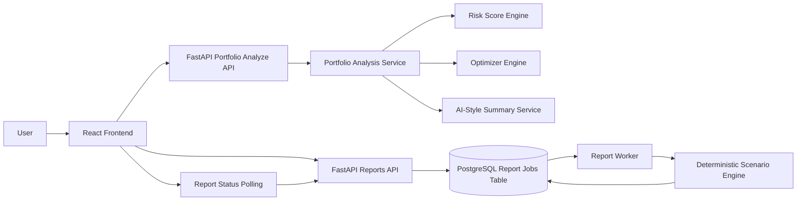

# Portfolio Optimizer Architecture

## Current Architecture

The Portfolio Optimizer is a full-stack application with a React frontend, FastAPI backend, PostgreSQL database, lightweight report worker, and deterministic AI-style explanation layers.



## Main Components

### Frontend

The React frontend lets users enter holdings, analyze portfolios, view charts, generate optimizer recommendations, and create scenario report jobs.

The frontend also polls report job status so the user always knows whether a report is pending, processing, complete, or failed.

### Backend API

The FastAPI backend exposes portfolio analysis, saved portfolio, snapshot, and report job endpoints.

The report API creates persistent report jobs and lets the frontend check job status.

### Database

PostgreSQL stores saved portfolios, holdings, snapshots, and report jobs.

Report jobs include:

- status
- request_json
- result_json
- error_message
- created_at
- updated_at

### Worker

The lightweight worker reads pending report jobs, marks them running, performs deterministic scenario calculations, saves results, and marks jobs completed or failed.

### Queue

The current queue is database-backed. This avoids extra infrastructure while still proving a real job lifecycle.

Future versions could replace this with Redis, RQ, Celery, or a cloud-native queue.

### AI-Style Services

The project includes AI-style explanations that only explain deterministic backend outputs.

They do not:

- predict future performance
- invent expected returns
- recommend securities outside deterministic outputs
- replace financial advice

## Report Lifecycle

```text
POST /api/reports
    -> create pending report job
    -> store request_json
    -> return job_id and status

PYTHONPATH=. python scripts/run_worker.py
    -> read pending job
    -> mark running
    -> run deterministic scenario report
    -> save result_json
    -> mark completed or failed

GET /api/reports/{id}
    -> return current status, result_json, or error_message
```

## Why This Design Works

This architecture keeps financial calculations deterministic, testable, and explainable.

The job lifecycle also makes the project easier to discuss in system design interviews because the report is no longer just a function call. It has persistence, status transitions, failure handling, polling, and restart behavior.